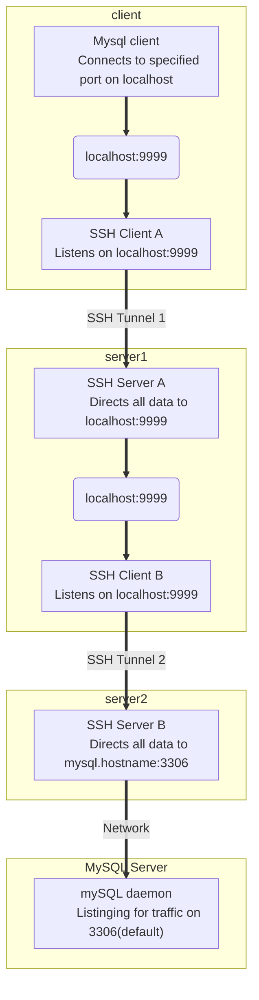

# scratch

## Tunneling to dev db
### Comamand
```
ssh -A -t -v -L 9999:localhost:9999 edc-dev \ ssh -A -t -L 9999:mysql:3306 web1
```
### Connection methodology

```mermaid
flowchart TB
    subgraph client
        subgraph mysqlClient["Mysql client
        Connects to specified port on localhost"]
        end
        subgraph sshClientA["SSH Client A
        Listens on localhost:9999"]
        end
        localhostA(localhost:9999)
        mysqlClient ==> localhostA ==> sshClientA
    end

    subgraph server1
        subgraph sshServerA["SSH Server A
        Directs all data to localhost:9999"]
        end
        subgraph sshClientB["SSH Client B
        Listens on localhost:9999"]
        end
        localhost(localhost:9999)
        sshServerA ==> localhost ==> sshClientB
    end

    subgraph server2
        subgraph sshServerB["SSH Server B
        Directs all data to mysql.hostname:3306"]
        end
    end

    subgraph mysqlA[MySQL Server]
        subgraph mysqlDaemon["mySQL daemon
        Listinging for traffic on 3306(default)"]
        end
    end

    sshClientA ==> |SSH Tunnel 1| sshServerA
    sshClientB ==> |SSH Tunnel 2| sshServerB
    sshServerB ==> |Network| mysqlDaemon
```


